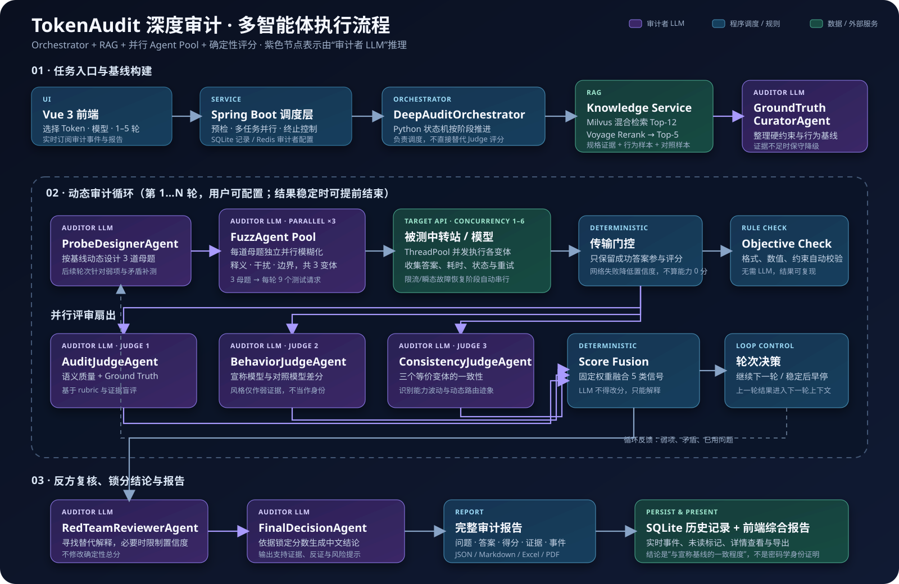

# TokenAudit

TokenAudit 是一个面向 OpenAI 兼容 API 与大模型中转站的 Token 审计平台。它不会仅凭接口返回的模型名下结论，而是结合真实请求、RAG 证据、动态探针、模糊变体和多个 Judge Agent，对“被测模型是否符合宣称模型的行为基线”给出带证据和置信度的判断。

> 本项目提供的是行为一致性审计，不是模型身份的密码学证明。动态路由、量化版本、系统提示词和上游策略都可能影响结果。

## 主要功能

- 快速审计：检查 Token 有效性、权限、模型声明、合规性、稳定性和基础安全风险。
- 深度审计：RAG 检索模型特征，动态生成 3 道基础题，每题产生 3 个模糊变体，再由多个 Agent 并行评分与红队复核。
- 通用中转兼容：接受基础 URL 或完整 `/chat/completions` 地址，不绑定 OpenRouter 等单一平台。
- 审计者 AI 可配置：服务商、API URL、模型、API Key 和有效期均可在前端设置；敏感配置存入 Redis DB 1，并在每次保存时重置 TTL。
- 多任务调度：后端支持审计队列、并行任务和单任务终止；目标中转请求在单个深度审计内默认串行，降低限流和断连风险。
- 真实事件流：前端实时展示预检、RAG、Agent、目标调用、评分和导出阶段。
- 历史与未读状态：区分快速/深度审计，可删除记录，并以未读圆点提示新报告。
- 报告导出：JSON、Markdown、Excel，可选 PDF。
- 本地知识库：Unstructured 清洗与分块、LlamaIndex 去重、Voyage Embedding/Rerank、Milvus Lite 向量检索。

## 架构



图中紫色节点由用户配置的“审计者 LLM”执行推理；蓝色节点负责确定性调度、规则校验与锁分，绿色节点代表知识库或被测中转站。每轮的 Fuzz Agent 和三个 Judge Agent 均并行执行；目标请求支持可配置并发，并在限流或瞬态网络故障恢复时自动退化为串行，避免重复浪费 Token。

```text
Vue 3 前端 :5173
    │
    ▼
Spring Boot API :8086
    ├── SQLite：Token 元数据、审计记录、事件流
    ├── Redis DB 1：审计者 AI 加密配置与 TTL
    └── Python 审计子进程
            ├── 快速审计 Agents
            └── 深度审计 Orchestrator
                    ├── Knowledge Service :8091
                    │     ├── Voyage Embedding / Rerank
                    │     └── Milvus Lite
                    ├── GroundTruthCuratorAgent
                    ├── ProbeDesignerAgent
                    ├── FuzzAgent
                    ├── Semantic / Behavior / Consistency Judges
                    ├── RedTeamAgent
                    └── FinalDecisionAgent
```

## 目录

```text
TokenAudit/
├── front-end/          # Vue 3 + Vite + Element Plus
├── back-end/           # Spring Boot + MyBatis + SQLite + Redis
├── audit-core/         # Python 快速/深度审计核心
├── knowledge-service/  # RAG 数据处理、Milvus 与检索服务
├── docs/rag/           # 数据源清单、处理产物和评测报告
├── scripts/            # 启动与 RAG 工具脚本
├── data/               # 本地数据库、Milvus、报告和运行数据（默认不提交）
├── requirements.txt    # Python 总依赖入口
└── .env.example        # 无密钥配置模板
```

## 环境要求

- Node.js 18+
- Java 17+
- Maven 3.8+
- Python 3.10 或 3.11
- Redis 6+
- 可选：Tesseract OCR（处理图片资料时使用）

Milvus 使用 `milvus-lite`，不要求 Docker。默认数据库位于项目的 `data/milvus/`。

## 安装

### 1. 创建本地配置

```powershell
Copy-Item .env.example .env
```

至少确认以下配置：

```properties
REDIS_HOST=127.0.0.1
REDIS_PORT=6379
REDIS_DATABASE=1
PYTHON_EXECUTABLE=python
AUDIT_CORE_WORKDIR=../audit-core
KNOWLEDGE_SERVICE_URL=http://127.0.0.1:8091
```

不要把 API Key 写入 `.env.example`。审计者 API Key 推荐在前端“设置”中保存；Voyage Key 只写入本地 `.env`：

```properties
EMBEDDING_API_KEY=
RERANK_API_KEY=
```

### 2. 安装 Python 依赖

```powershell
python -m venv .venv
.\.venv\Scripts\Activate.ps1
python -m pip install --upgrade pip
pip install -r requirements.txt
```

也可以分别安装：

```powershell
pip install -r audit-core\requirements.txt
pip install -r knowledge-service\requirements.txt
```

### 3. 安装前端依赖

```powershell
cd front-end
npm install
cd ..
```

## 启动

### 一键启动（Windows）

```powershell
.\scripts\start-all.ps1
```

默认地址：

- 前端：`http://127.0.0.1:5173`
- 后端：`http://127.0.0.1:8086`
- 知识服务健康检查：`http://127.0.0.1:8091/health`

### 分别启动

知识服务：

```powershell
cd knowledge-service
python -m tokenaudit_knowledge.server --env-file ..\.env --host 127.0.0.1 --port 8091
```

后端：

```powershell
cd back-end
mvn spring-boot:run
```

前端：

```powershell
cd front-end
npm run dev
```

## 使用流程

1. 在右上角“设置”中配置审计者 AI。URL 应填写该服务商完整的 OpenAI 兼容 Chat Completions 地址。
2. 在 Token 工作区新增被测 Token，填写中转站名称、API URL 和宣称模型。模型下拉框支持选择与自由输入。
3. 选择“快速审计”或“深度审计”。深度审计可设置 1–5 轮；每轮的问题会动态变化。
4. 在实时事件终端观察预检、RAG、Agent 和目标模型调用。
5. 完成后从历史记录打开综合报告。新报告显示未读圆点，打开后自动消失。

### 深度审计评分

默认融合以下信号：

| 组成 | 权重 | 含义 |
| --- | ---: | --- |
| Objective | 10% | 可程序化验证的格式、数值和约束 |
| Semantic | 30% | 回答与 Ground Truth 的语义符合度 |
| Official Ground Truth | 25% | 官方/高可信资料支持度 |
| Behavior Differential | 20% | 与对照行为特征的区分度 |
| Fuzz Consistency | 15% | 同题变体下的稳定性 |

Judge Agent 只评价成功返回的答案；网络失败会保留在报告中并降低置信度，不再自动按能力 0 分。若所有答案均不可用，审计才会终止。

被测模型首请求的 `max_tokens` 上限为 `99,999`，用于避免截断自然回答，并不要求模型输出这么多。默认读取超时为 600 秒；只有真实传输错误才进入降预算恢复流程。

## RAG 策略

```text
网页/Markdown
  → Unstructured 结构识别、去噪、表格与 OCR
  → chunk_by_title
  → LlamaIndex 去重
  → Voyage Embedding
  → Milvus COSINE 混合检索 Top-12
  → Voyage Rerank 保留 Top-5
  → GroundTruthCuratorAgent
```

默认分块参数：

```properties
RAG_CHUNK_MAX_CHARACTERS=1800
RAG_CHUNK_NEW_AFTER_CHARACTERS=1200
RAG_CHUNK_COMBINE_UNDER_CHARACTERS=300
RAG_CHUNK_OVERLAP_CHARACTERS=120
```

详细的数据处理、准入规则和评测方法见 [knowledge-service/README.md](knowledge-service/README.md) 与 [docs/rag/README.md](docs/rag/README.md)。

## 主要 API

| 方法 | 路径 | 用途 |
| --- | --- | --- |
| `GET` | `/api/tokens` | Token 列表 |
| `POST` | `/api/tokens` | 新增 Token |
| `PUT` | `/api/tokens/{id}/url` | 修改 Token API URL |
| `POST` | `/api/audits` | 发起快速审计 |
| `POST` | `/api/audits/deep` | 发起深度审计 |
| `POST` | `/api/audits/{id}/cancel` | 终止审计 |
| `DELETE` | `/api/audits/{id}` | 删除历史审计 |
| `GET` | `/api/audits/{id}` | 状态与报告 |
| `GET` | `/api/audits/{id}/events` | 实时事件流 |
| `GET/PUT/DELETE` | `/api/settings/audit-ai` | 审计者 AI 配置 |

## 测试

```powershell
cd audit-core
python -m pytest -q

cd ..\knowledge-service
python -m pytest -q

cd ..\back-end
mvn test

cd ..\front-end
npm test
npm run build
```

## 常见问题

### 保存审计者配置时出现 Network Error

确认后端运行在 `8086`，并检查 `VITE_BACKEND_BASE_URL` 与 `BACKEND_ALLOWED_ORIGINS`。

### 中转站预检失败

优先确认 URL、模型 ID、Token 权限、余额、代理与 Cloudflare/WAF。DNS 完整性诊断默认关闭；即使开启也只记录提示，不会替代真实 TLS/API 预检。

### 深度审计只有部分回答

报告会明确标记网络不稳定，仅按成功答案评分并降低置信度。建议降低任务并发，而不是盲目重复整场审计。

### Excel 或 PDF 导出失败

- Excel 需要 `openpyxl`，已包含在 `audit-core/requirements.txt`。
- PDF 需要 `fpdf2` 和可用中文字体，可用 `AUDIT_PDF_FONT_TTF` 指定 `.ttf` 文件。

## 安全说明

- `.env`、SQLite、Milvus 数据库、报告和运行日志默认由 `.gitignore` 排除。
- 被测 Token 在 SQLite 中加密保存；密钥由 `TOKEN_ENCRYPTION_KEY` 或本地密钥文件提供。
- 审计者 API Key 加密存入 Redis，并受用户设置的 TTL 控制。
- 任何真实 API Key 都不应出现在 README、示例配置、测试数据或 Git 历史中。
- 上传仓库前建议再次运行密钥扫描，并确认 `git status` 不包含运行数据。

## 免责声明

请只审计你拥有或明确获准测试的 Token 和服务。审计结果受样本规模、网络环境、上游路由与模型版本影响，不应单独用于高风险决策。
